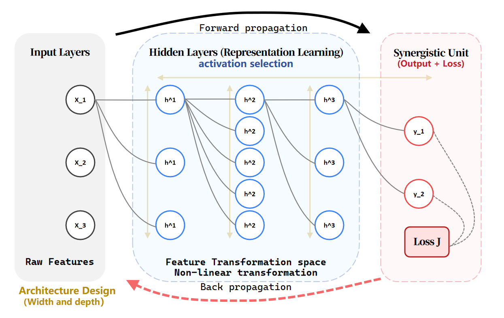
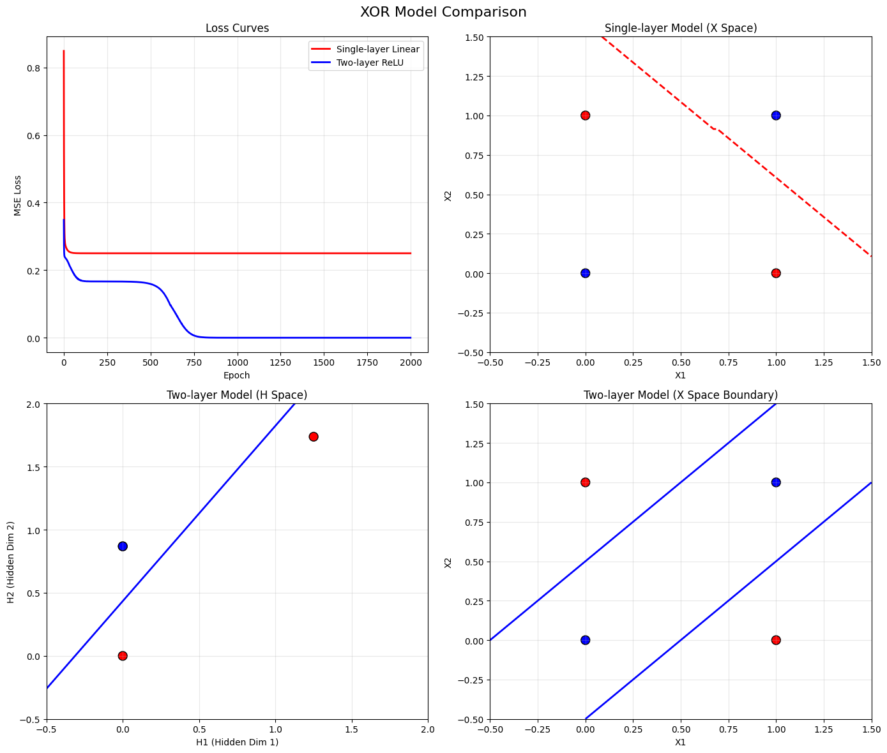

# Deep Feedforward Netword

**深度前馈神经网络定义**
> 深度前馈神经网络，也叫前馈神经网络或多层感知机（Multitlayer perceptron, MLP）， 是典型的深度学习模型，**目标是**近似某个函数 $f^* $。
> 
> 其中**前向**(feedforward)的含义是，信息单向地经由定义的函数 $f $从 $x $流向 $y $，在模型的输出 $y $和模型本身之间没有反馈连接（与之相对的是循环神经网络, RNN）
>
> 而**网络**的含义是，它通常由都铎不同的函数复合在一起，复合函数形成链路，链路的长度就是网络的**深度**。



**线性模型到非线性模型**

> 从最简单的线性模型入手，模型的一般结构为 $f(x) = wx + b $，为了引入非线性，可以将线性模型用于一个变换后的输入 $\phi(x) $上， $\phi(x) $是一个非线性函数，这就是机器学习中常见的[核技巧](./docs/Math_concept.md#核技巧与非线性)。

对于一般的深度学习模型，可以简单理解为 $\phi(x) $表示除输出层外，前面所有的隐藏层和输入层。当然有时最终的输出层也会使用激活函数，但输出层的激活函数的设计更多地需要考虑任务类型并与代价函数协作。

**章节概览**
> 深度前馈网络可以视为一种高效的**非线性函数近似器**。其设计决策通常包含元素：优化模型、代价函数、输出形式、隐藏层激活函数、模型架构的基本单元，层数，宽度、优化方法等。
> 从最基础的问题出发：从线性函数的近似到非线性函数的近似，关键在于引入包含非线性变换的隐藏层。成功引入非线性后，需要考虑的问题还有
* 针对不同的近似目标，如何找到最优解（优化方法）
* 对于更通用的梯度下降优化方法，针对不同任务应该设置什么样的优化目标（输出与代价函数的设计）
* 隐藏层的设计：
* 架构设计：深度与宽度
* 自动梯度优化实现：反向传播和其它微分算法

## 实例：XOR学习

考虑先从一个简单的任务入手构建一个可以完整运行的神经网络。

**拟合XOR任务**
> XOR函数是一个二元布尔函数，定义式为： $A⊕B=(A∨B)∧¬(A∧B) $
>
> 在这个简单的例子中，总共只有四种可能的输入输出组合，我们不考虑统计泛化，仅希望函数在这四个已知点上表现正确。

### 输出与代价函数
**符号定义**

 $目标函数：f^*(x)\quad模型函数f(x;\theta) $

 $ $J(\theta) = \frac{1}{4}\sum_{x \in X}(f^*(x) - f(x;\theta))^2 \quad X = \{[0,0]^T,[0, 1]^T,[1, 0]^T,[1,1]^T\} $ $

这里使用最常见的MSE代价函数。虽然它在二进制预测任务中并不非常合适，但是在这个简单场景下已足够胜任。对于模型函数 $f(x;\theta) $的输入，与MSE相应的输出相对应的是一个实数，直接表示预测的y值。

### 模型形式 

> 首先尝试定义一个线性模型：
 $ $f(X; W, b) = X^TW + b $ $

利用使用[正规方程](./docs/Math_concept.md#闭解式与正规方程)关于 $W,b $最小化 $J(\theta) $，得到[闭解式](./docs/Math_concept.md#闭解式与正规方程)。解得 $W = [0, 0]^T, b = 1/2 $。此时 $J(W, b) = 1/2 $，模型在任意一点都输出0.5，说明当前模型无法正确学到XOR函数。

> 接下来尝试引入隐藏层，先将 $X $映射到变换的特征空间，再利用放射函数映射到 $Y $

 $ $ f(X; W_1, W_2, b_1, b_2) = f_2(f_1(x; W_1, b_1), W_2, b_2) $ $
 $ $ H = f_1(X; W_1, b_1) = X^TW_1 + b_1 \quad Y = f_2(H; W_2, b_2) = HW_2 + b_2 $ $

> 如果没有引入激活函数，上式仍可以化简为一个单层的线性模型

 $ $f(X; W_1, W_2, b_1, b_2) = (X^TW_1+b_1)W_2 + b_2 = X^T(W_1W_2) + (b_1W_w + b_2) $ $

化简后本质上和一个单层的线性模型没有区别，想要引入非线性还需要在隐藏层加入激活函数。

> 以最常见的`RELU`激活函数为例

 $ $f(X; W_1, W_2, b_1, b_2) = f_2(RELU(f_1(x; W_1, b_1)), W_2, b_2) \quad RELU(z) = max\{0, z\} $ $

下面通过[代码实现一个简单梯度优化程序](./imply_basic.ipynb)得到其中一个解

```python
class ReluModel(nn.Module):
    """Two layer model with ReLU activation"""
    def __init__(self, hidden_dim=2):
        super(ReluModel, self).__init__()
        self.hidden = nn.Linear(2, hidden_dim)
        self.output = nn.Linear(hidden_dim, 1)
        self.relu = nn.ReLU()

    def forward(self, x):
        x = self.hidden(x)
        x = self.relu(x)
        x = self.output(x)
        return x
criterion = torch.nn.MSELoss()
optimizer = torch.optim.SGD(model.parameters(), lr=lr)
```



> 子图1. 单层线性模型与双层非线性模型损失下降图；子图2. 单层线性模型在X原始特征空间的预测结果可视化；子图3. 双层非线性模型在H隐层特征空间的预测结果可视化；子图4. 双层非线性模型在X原始特征空间的预测结果可视化

理想情况下，引入包含激活函数的隐藏层后，这个双层模型就能够正确拟合XOR函数，实际运行中，模型是否正确分类非常依赖于参数的初始化过程，会出现“时好时不好的情况”，详细分析见[XOR函数拟合不稳定性分析与实验](./docs/XOR_instability.md)


## 基于梯度的学习

目前为止，线性模型与较大的神经网络的最大区别在于，神经网络的非线性导致大多数我们感兴趣的代价函数都是**非凸的**。用于非凸函数的梯度下降算法没有收敛到全局最优点的收敛性保证，并且对于参数的初始值很敏感。当然大多数情况下我们只要求代价函数能下降到一个足够小的值就可以。

为了使用基于梯度的学习方法，我们必须选择一个**代价函数**和**模型的输出表示**。以适配任务需求以及梯度下降算法的需求。

> 大多数情况下，参数模型定义了一个分布 $P(y| x;\theta) $并且简单地使用了**最大似然原理**。

 $ $\theta = argmax_\theta \mathcal{L}(\theta|D) $ $

模型参数： $\theta $

似然： $\mathcal{L}(\theta|D) = \prod_{i=1}^np(X_i|\theta) $

独立同分布观测值： $D=(X_1, X_2, ..., X_n)  $

样本服从分布： $P(X|\theta) $，其中 $\theta $是待估计的参数模型

> 最大化对数似然和最小化代价函数是等价的，此时代价函数可以写作负的对数似然

 $ $ J(\theta) = -E_{\textbf {x, y} \sim \hat p_{data}}log p_{model}(\textbf{y}| \textbf{x}) $ $

### 代价函数

任务|分类|回归
--|--|--
输出形式|归一化的各个类别的概率预测值|实数或实数向量
标签|类别one-hot编码|实数或实数标签
输出含义|属于各个类别的概率分布-(直接输出分布)|结果高斯分布的均值-(输出假设分布的部分参数/统计量)
代价函数等价形式| $-\frac{1}{n}\sum_{i=1}^n \sum_{j=1}^C p(y_{ij})log \hat p(y_{ij}) $| $\frac{1}{2}E_{\textbf {x, y} \sim \hat p_{data}}\|\|\textbf{y} - f(\textbf{x;}\theta)\|\|^2 $
常见名称|交叉熵|均方误差损失MSE

证明过程见[数学概念](./docs/Math_concept.md)部分。

### 输出形式

> 输出形式需要考虑到预测目标分布参数情况，如参数类型，参数范围等。
>
> 我们假设前馈网络提供了一组定义为 $h = f(x;\theta) $的隐藏特征。输出层的作用是随后对这些特征进行一些额外的变换来完成整个网络必须完成的任务。
>
> 常见个设计需求包括：避免梯度爆炸和梯度消失（饱和）、输出值的范围符合假设分布的参数取值区间等

任务|回归|二分类|多分类
--|--|--|--
分布假设|高斯分布|伯努利分布|多项伯努利分布
预测参数|高斯分布均值|分类为1的概率|各个分类的概率
设计考量|线性单元不会饱和|预测值域为(0, 1)|各类概率值域为(0, 1)，和为1
输出层| 线性输出单元| sigmoid(线性输出单元) | softmax(线性输出单元)
使用损失|均方误差MSE|二分类交叉熵BCE|交叉熵CrossEntropy

有关`sigmoid`损失的推导，`softplus`函数以及`softmax`函数的推导以及相关性质见[输出层数学证明](./docs/Math_concept.md#输出层数学证明)

## 隐藏单元

> 前馈网络引入了隐藏单元，这给带来一个问题，**应该如何选择隐藏单元的类型**
>
> 通过数学证明决定何时使用哪种隐藏单元是一件非常困难的事。证明一种类型的隐藏单元的优劣需要利用直觉选择一种隐藏单元，并通过训练和在测试集上评估性能来得出结论。
>
> 大多数隐藏单元的区别仅仅在于激活函数，一般整流线性单元就是一个非常好的默认选择。

### 整流线性单元及其变体性质
 $ $RELU(x) = max\{0, x\} $ $

* 可微：一般而言，只在少数点上不可微的函数时可以接受的
* 当输入为正时，被激活。激活函数本身一阶导为1，二阶导为0，可以较大程度上保留原始输入的梯度不变，不会引入更多数值问题，对于梯度下降算法非常友好

**变体**（大多数情况与RELU表现持平，偶尔更好）：
* 绝对值整流：取绝对值
* 渗漏蒸馏线性单元:  $max(0, x) + \alpha min(0, x) $
* 参数化整流线性单元： $\alpha $变成可学习参数

> 以上扩展都基于一个原则：如何其行为更接近线性，那么模型更容易优化

### 其它隐藏单元

存在很多其它种类的隐藏单元，但是他们并不常用。

一般而言，只有新的隐藏单元在被明确证明显著优于整流线性单元时才会被发布。通常默认选择整流线性单元。

## 架构设计

> **架构**一词指的是网络的整体结构：它应该具有多少单元，以及这些单元应该如何连接。
>
> 在一般的链式架构中，主要考虑的是选择网络的深度和每一层的宽度，理想的网络架构必须通过实验，观测在测试集上的误差来找到。

### 万能近似性质和深度

## 反向传播和其它微分算法


## 历史小计

