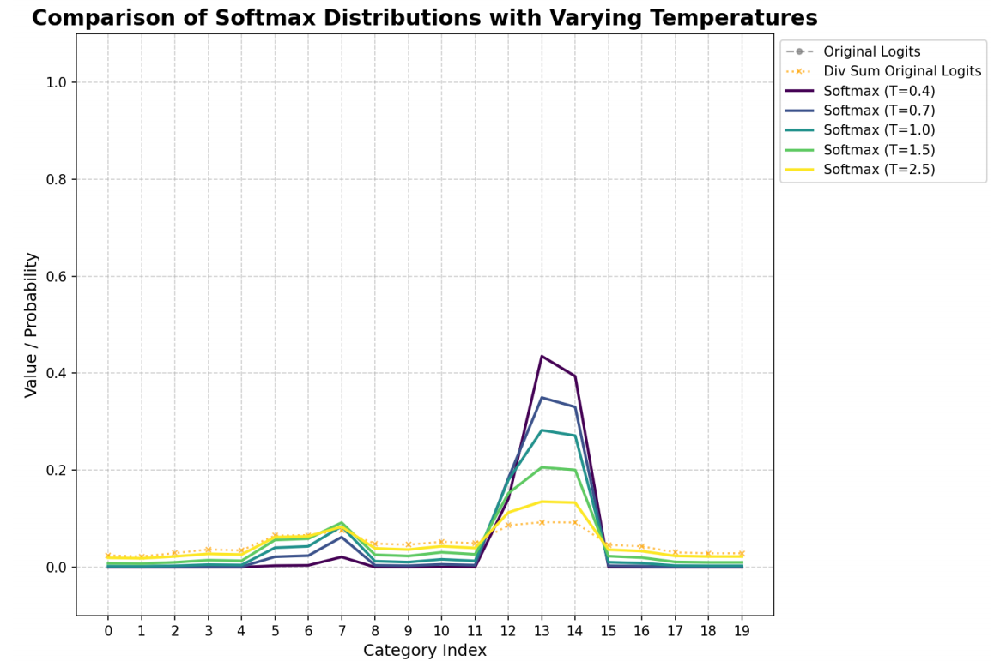

# 核技巧与非线性

在机器学习中，**核技巧**（Kernel Trick） 是一项非常巧妙的技术，它能让原本只能处理线性问题的算法（如支持向量机 SVM）轻松处理极其复杂的非线性数据，而又不需要付出巨大的计算代价。

简单来说，核技巧的**核心思想是：“升维打击”**。

在低维空间中，很多数据是线性不可分的。如果我们将这些点映射到一个更高维的空间（比如三维），这些点可能会散开，从而使我们能够用一个平面（超平面）完美地将它们分开。

> 深度学习的策略一般是让模型自动学习核函数 $\phi $

# 闭解式与正规方程

**闭解式**是指可以通过有限次基本运算（加、减、乘、除、幂、开方等）直接表达出最优解的数学公式，无需迭代求解。
* 特点：解的表达式是显式的，代入参数后可直接计算出结果。
* 适用场景：目标函数是凸函数且具有连续可微性，例如线性回归的损失函数（均方误差）。

**正规方程**是线性回归中求解最优参数的特定闭解式，通过令损失函数对参数的梯度为 0 推导得出，是闭解式在线性回归问题中的具体体现。

**线性回归的基本模型**： $$y = X\theta + \epsilon $$

其中：
*  $X \in \mathbb{R}^{m \times n} $：特征矩阵（m 个样本，n 个特征）
*  $\theta \in \mathbb{R}^{n} $：待求的参数向量
*  $y \in \mathbb{R}^{m} $：标签向量
*  $\epsilon $：误差项。

损失函数（均方误差 MSE）： $J(\theta) = \frac{1}{2m}\sum_{i=1}^m (h_\theta(x^{(i)}) - y^{(i)})^2 = \frac{1}{2m}(X\theta - y)^T(X\theta - y) $

正规方程：令损失函数的梯度  $\nabla_\theta J(\theta) = 0 $，**推导得到的参数最优解公式**： $\theta^* = (X^TX)^{-1}X^Ty $

> 练习
> 
> 利用线性回归基本模型的正规方程求XOR问题的闭解式解。

# 最大似然与常见损失项

## 分类交叉熵损失

分类问题模型的输出应该是归一化的概率值，可以直接认为是预测结果的分布。最大化似然等价于最小化负对数似然

 $$\mathcal{L}(\theta) = -log\prod_{i=1}^n p_{model}(y_i|x_i) $$
 $$= -\sum_{i=1}^n logP_{model}(y_i|x_i) $$

这里 $y_i $对应样本的真实标签类别，由于真实标签是`one-hot`编码，非真实标签对应的概率都为零，交叉熵考虑这一点后与上面化简后的负对数似然是等价的。

## 回归均值平方差损失

回归问题中，假设已知观测量x后，预测目标值满足高斯分布 $p(y|x) = \mathcal{N}(y; f(x; \theta), I) $，模型仅预测高斯分布中的均值参数 $\mu $，并不关心分布的方差，这里假设为单位方差方便后续简化。

 $$\mathcal{L} = -\sum_{i=1}^n log \frac{1}{\sqrt{2\pi\sigma}}exp (\frac{(\mu - \hat y)^2}{2\sigma^2}) $$
 $$ = -\sum_{i=1}^n \frac{(\mu - \hat y)^2}{2\sigma^2} + log \frac{1}{\sqrt{2\pi\sigma}} $$

考虑到假设的方差为1，且常数部分求导可忽略，上述式子可以等价于均方误差MSE。

## 饱和问题的考量

常见的输出函数会包含指数部分，这使得输入最终输出层的激活值会在绝对值很大的负值处出现饱和问题，负的对数似然可以避免这个问题。

# 输出层数学证明

## 二分类输出分布的Sigmoid函数

二分类问题中，可以只预测其中一个类别的概率。输出层应满足以下条件
* 概率值域为(0, 1)
* 无论何时，模型给出一个错误的答案时，总能有一个较大的梯度

> 从基础的伯努利开始推导，寻找一个合适的输出激活函数
 $$p(y | x) = p^y(1-p)^{1-y} $$
> 对上式两边取自然对数
 $$lnp(y|x) = yln(\frac{p}{1-p}) + ln(1-p) $$
> 上式中 $ln(\frac{p}{1-p}) $即为**对数几率（Log-odds）**, 是对事件“发生与不发生概率的比值”取对数的结果，取值范围为整个实数域，和线性层输出范围相同。上式右侧部分与模型输出无关，仅表示一个用于归一化的常数。

> 基于上述发现，可以用模型输出先表示一个非归一化的概率值，然后再进行归一化得到一个概率值。

 $$log \tilde{p}(y) = yz $$
 $$\tilde{p}(y) = exp(yz) $$
> 归一化
 $$p(y) = \frac{exp(yz)}{\sum_{y'=0}^1exp(y'z)} $$
 $$p(y) = \sigma((2y-1)z) $$

sigmoid函数： $\sigma(x) = \frac{1}{1 + exp(-x)} $

> 对于二分类任务，可以只预测样本为正类的概率，即 $p(y{_正}) = \sigma(x) $，后续使用二分类交叉熵计算代价时，也应对应模型输出值为正类概率。

考察上述两个要求：
* 值域问题，显然sigmoid函数能将任意数值映射到(0, 1)区间内
* 梯度问题，在sigmoid输出后搭配负对数损失即为`softplus`函数，当线性预测 $z $的符号不对且偏离严重时(为绝对值大的负数)，有 $\mathcal{L} = -log\sigma(z) $大约与z的绝对值相当，满足z偏离很大时有一个较大的梯度。

## 多分类

> 多分类可以视作多元伯努利分布，要求每个类别概率在(0, 1)且所有类别概率和为1。

本质上N元伯努利分布只需要 $n-1 $个参数就可以唯一确定，事实上二分类任务中就是用一个参数确定了2元伯努利分布。实际应用时还是使用 $n $个归一化后的参数确定，这个操作为`softmax`，可以视作`sigmoid`的多元拓展版本。

 $$softmax(z)= \frac{exp(z_i)}{\sum_{j=1}^nexp(z_j)} $$

> 当使用最大化对数似然训练`softmax`来输出目标值y时，使用指数工作是个非常好的选择（log和exp搭配避免了梯度饱和）

 $$log\ softmax = z_i - log\sum_j exp(z_j) $$

> 对于`softmax`函数本身，其存在一些明显的数值问题，当指数函数输入取非常小的负值时，会造成梯度消失，不过通过在损失处引入对数操作可以很好地抵消这个缺点。

**softmax感性认识**

`soft argmax`可能是一个更适合的名称，softmax更像是`argmax`的软化版本，常见的操作就包括对输入除以一个温度系数，以更灵活地控制软化程度。

 $$softmax(z, \tau)= \frac{exp(z_i/\tau)}{\sum_{j=1}^nexp(z_j/\tau)} $$

